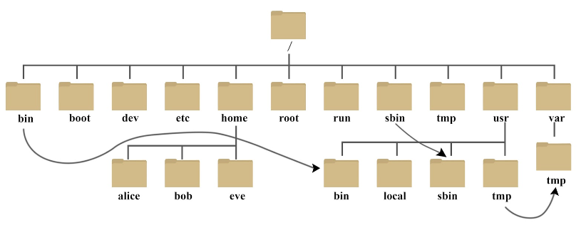

# Linux
是一个基于POSIX和Unix的多用户、多任务、支持多线程和多CPU的操作系统。它能运行主要的Unix工具软件、应用程序和网络协议。它支持32位和64位硬件。
## 一、 基础知识
### 1.什么是Linux？
是一套免费使用和自由传播的类UNIX操作系统，其内核由林纳斯·本纳第克特·托瓦兹于1991年第一次释出，它主要受到Minix和Unix思想的启发，是一个基于POSIX和Unix的多用户、多任务、支持多线程和多CPU的操作系统。它能运行主要的Unix工具软件、应用程序和网络协议。它支持32位和64位硬件
### 2. Linux内核主要负责哪些功能
* 系统内存管理
* 软件程序管理
* 硬件设备管理
* 文件系统管理
### 3.交互方式
控制台终端、图形化终端
### 4.启动shell
GNU bash shell能提供对linux 系统的交互式访问。作为普通程序运行，通常在用户登陆终端时启动。登录时系统启动的shell依赖与用户账户的配置。
### 5.bash手册
大多数linux发行版自带以查找shell命令及其他GNU工具信息的在线手册。man命令用来访问linux系统上的手册页面。当用man命令查看手册，使用分页的程序来现实的。
### 6.登陆后你在的位置？
一般登陆后，你的位置位于自己的主目录中。
### 7. 一切皆文件
Linux 中所有内容都是以文件的形式保存和管理，包括一切软硬件。 这样做最明显的好处是，开发者仅需要一套 API 和开发工具即可调取 Linux 系统中绝大部分的资源。同时也带来不利之处，如使用任何硬件设备都必须与根目录下某一目录执行挂载操作，否则无法使用。
### 8. linux系统的文件结构
树状目录结构：

以下是对这些目录的解释：

* /bin：
bin 是 Binaries (二进制文件) 的缩写, 这个目录存放着最经常使用的命令。

* /boot：
这里存放的是启动 Linux 时使用的一些核心文件，包括一些连接文件以及镜像文件。

* /dev ：
dev 是 Device(设备) 的缩写, 该目录下存放的是 Linux 的外部设备，在 Linux 中访问设备的方式和访问文件的方式是相同的。

* /etc：
etc 是 Etcetera(等等) 的缩写,这个目录用来存放所有的系统管理所需要的配置文件和子目录。

* /home：
用户的主目录，在 Linux 中，每个用户都有一个自己的目录，一般该目录名是以用户的账号命名的，如上图中的 alice、bob 和 eve。

* /lib：
lib 是 Library(库) 的缩写这个目录里存放着系统最基本的动态连接共享库，其作用类似于 Windows 里的 DLL 文件。几乎所有的应用程序都需要用到这些共享库。

* /lost+found：
这个目录一般情况下是空的，当系统非法关机后，这里就存放了一些文件。

* /media：
linux 系统会自动识别一些设备，例如U盘、光驱等等，当识别后，Linux 会把识别的设备挂载到这个目录下。

* /mnt：
系统提供该目录是为了让用户临时挂载别的文件系统的，我们可以将光驱挂载在 /mnt/ 上，然后进入该目录就可以查看光驱里的内容了。

* /opt：
opt 是 optional(可选) 的缩写，这是给主机额外安装软件所摆放的目录。比如你安装一个ORACLE数据库则就可以放到这个目录下。默认是空的。

* /proc：
proc 是 Processes(进程) 的缩写，/proc 是一种伪文件系统（也即虚拟文件系统），存储的是当前内核运行状态的一系列特殊文件，这个目录是一个虚拟的目录，它是系统内存的映射，我们可以通过直接访问这个目录来获取系统信息。

这个目录的内容不在硬盘上而是在内存里，我们也可以直接修改里面的某些文件，比如可以通过下面的命令来屏蔽主机的ping命令，使别人无法ping你的机器：
`echo 1 > /proc/sys/net/ipv4/icmp_echo_ignore_all`

* /root
该目录为系统管理员，也称作超级权限者的用户主目录。

* /sbin：
s 就是 Super User 的意思，是 Superuser Binaries (超级用户的二进制文件) 的缩写，这里存放的是系统管理员使用的系统管理程序。

* /selinux：
 这个目录是 Redhat/CentOS 所特有的目录，Selinux 是一个安全机制，类似于 windows 的防火墙，但是这套机制比较复杂，这个目录就是存放selinux相关的文件的。

* /srv：
 该目录存放一些服务启动之后需要提取的数据。

* /sys：

这是 Linux2.6 内核的一个很大的变化。该目录下安装了 2.6 内核中新出现的一个文件系统 sysfs 。

sysfs 文件系统集成了下面3种文件系统的信息：针对进程信息的 proc 文件系统、针对设备的 devfs 文件系统以及针对伪终端的 devpts 文件系统。

该文件系统是内核设备树的一个直观反映。

当一个内核对象被创建的时候，对应的文件和目录也在内核对象子系统中被创建。

* /tmp：
tmp 是 temporary(临时) 的缩写这个目录是用来存放一些临时文件的。

* /usr：
 usr 是 unix shared resources(共享资源) 的缩写，这是一个非常重要的目录，用户的很多应用程序和文件都放在这个目录下，类似于 windows 下的 program files 目录。

* /usr/bin：
系统用户使用的应用程序。

* /usr/sbin：
超级用户使用的比较高级的管理程序和系统守护程序。

* /usr/src：
内核源代码默认的放置目录。

* /var：
var 是 variable(变量) 的缩写，这个目录中存放着在不断扩充着的东西，我们习惯将那些经常被修改的目录放在这个目录下。包括各种日志文件。

* /run：
是一个临时文件系统，存储系统启动以来的信息。当系统重启时，这个目录下的文件应该被删掉或清除。如果你的系统上有 /var/run 目录，应该让它指向 run。

在 Linux 系统中，有几个目录是比较重要的，平时需要注意不要误删除或者随意更改内部文件。

/etc： 上边也提到了，这个是系统中的配置文件，如果你更改了该目录下的某个文件可能会导致系统不能启动。

/bin, /sbin, /usr/bin, /usr/sbin: 这是系统预设的执行文件的放置目录，比如 ls 就是在 /bin/ls 目录下的。

值得提出的是 /bin、/usr/bin 是给系统用户使用的指令（除 root 外的通用用户），而/sbin, /usr/sbin 则是给 root 使用的指令。

/var： 这是一个非常重要的目录，系统上跑了很多程序，那么每个程序都会有相应的日志产生，而这些日志就被记录到这个目录下，具体在 /var/log 目录下，另外 mail 的预设放置也是在这里。
## 二、 命令
命令格式 `示例：命令 参数名 参数值`

### 1. 基础操作
#### 1.1 关闭系统
(1)立刻关机
  shutdown -h now 或者 poweroff

(2)两分钟后关机
  shutdown -h 2

#### 1.2 关闭重启
(1)立刻重启
  shutdown -r now 或者 reboot

(2)两分钟后重启
  shutdown -r 2 

#### 1.3 帮助命令（help）
  ifconfig  --help // 查看 ifconfig 命令的用法

#### 1.4 切换用户（su）
  su yao               // 切换为用户"yao",输入后回车需要输入该用户的密码

  exit                 //退出当前用户

### 2. 目录操作
#### 2.1 切换目录（cd）
```
cd /                 //切换到根目录
cd /bin              //切换到根目录下的bin目录
cd ../               //切换到上一级目录 或者使用命令：cd ..
cd ~                 //切换到home目录
cd -                 //切换到上次访问的目录
cd xx(文件夹名)       //切换到本目录下的名为xx的文件目录，如果目录不存在报错
cd /xxx/xx/x         //可以输入完整的路径，直接切换到目标目录，输入过程中可以使用tab键快速补全
```
#### 2.2 查看目录（ls）
```
ls                   //查看当前目录下的所有目录和文件
ls -a                //查看当前目录下的所有目录和文件（包括隐藏的文件）
ls -l                //列表查看当前目录下的所有目录和文件（列表查看，显示更多信息），与命令"ll"效果一样
ls /bin              //查看指定目录下的所有目录和文件 
```
#### 2.3 创建目录（mkdir）
```
mkdir tools          //在当前目录下创建一个名为tools的目录
mkdir /bin/tools     //在指定目录下创建一个名为tools的目录
```
#### 2.3 删除目录与文件（rm）
```
rm 文件名              //删除当前目录下的文件
rm -f 文件名           //删除当前目录的的文件（不询问）
rm -r 文件夹名         //递归删除当前目录下此名的目录
rm -rf 文件夹名        //递归删除当前目录下此名的目录（不询问）
rm -rf *              //将当前目录下的所有目录和文件全部删除
rm -rf /*             //将根目录下的所有文件全部删除【慎用！相当于格式化系统】
```
#### 2.4 修改目录（mv）
```
mv 当前目录名 新目录名        //修改目录名，同样适用与文件操作
mv /usr/tmp/tool /opt       //将/usr/tmp目录下的tool目录剪切到 /opt目录下面
mv -r /usr/tmp/tool /opt    //递归剪切目录中所有文件和文件夹
```
#### 2.5 拷贝目录（cp）
```
cp /usr/tmp/tool /opt       //将/usr/tmp目录下的tool目录复制到 /opt目录下面
cp -r /usr/tmp/tool /opt    //递归剪复制目录中所有文件和文件夹
```
#### 2.6 搜索目录（find）
```
find /bin -name 'a*'        //查找/bin目录下的所有以a开头的文件或者目录
```
#### 2.7 查看当前目录（pwd）
```
pwd                         //显示当前位置路径
```
### 3. 文件操作
#### 3.1 新增文件（touch）
```
touch  a.txt         //在当前目录下创建名为a的txt文件（文件不存在），如果文件存在，将文件时间属性修改为当前系统时间
```
#### 3.2 删除文件（rm）
```
rm 文件名              //删除当前目录下的文件
rm -f 文件名           //删除当前目录的的文件（不询问）
```
#### 3.3 编辑文件（vi、vim）
```
vi 文件名              //打开需要编辑的文件
```
  
- 进入后，操作界面有三种模式：命令模式（command mode）、插入模式（Insert mode）和底行模式（last line mode）
命令模式
- 刚进入文件就是命令模式，通过方向键控制光标位置，
- 使用命令"dd"删除当前整行
- 使用命令"/字段"进行查找
- 按"i"在光标所在字符前开始插入
- 按"a"在光标所在字符后开始插入
- 按"o"在光标所在行的下面另起一新行插入
- 按"："进入底行模式

插入模式
- 此时可以对文件内容进行编辑，左下角会显示 "-- 插入 --""
- 按"ESC"进入底行模式

底行模式
- 退出编辑：      :q
- 强制退出：      :q!
- 保存并退出：    :wq
## 操作步骤示例 ##
1. 保存文件：按"ESC" -> 输入":" -> 输入"wq",回车     //保存并退出编辑
2. 取消操作：按"ESC" -> 输入":" -> 输入"q!",回车     //撤销本次修改并退出编辑
## 补充 ##
```
vim +10 filename.txt                   //打开文件并跳到第10行
vim -R /etc/passwd                     //以只读模式打开文件
```
#### 3.4 查看文件
```
cat a.txt          //查看文件最后一屏内容
less a.txt         //PgUp向上翻页，PgDn向下翻页，"q"退出查看
more a.txt         //显示百分比，回车查看下一行，空格查看下一页，"q"退出查看
tail -100 a.txt    //查看文件的后100行，"Ctrl+C"退出查看
```
### 4. 文件权限
#### 4.1 权限说明
```
文件权限简介：'r' 代表可读（4），'w' 代表可写（2），'x' 代表执行权限（1），括号内代表"8421法"
##文件权限信息示例：-rwxrw-r--
  -第一位：'-'就代表是文件，'d'代表是文件夹
  -第一组三位：拥有者的权限
  -第二组三位：拥有者所在的组，组员的权限
  -第三组三位：代表的是其他用户的权限
  ```
#### 4.2 文件权限
```
普通授权    chmod +x a.txt    
8421法     chmod 777 a.txt     //1+2+4=7，"7"说明授予所有权限
```
### 5. 打包与解压
#### 5.1 说明
```
.zip、.rar        //windows系统中压缩文件的扩展名
.tar              //Linux中打包文件的扩展名
.gz               //Linux中压缩文件的扩展名
.tar.gz           //Linux中打包并压缩文件的扩展名
```
#### 5.2 打包文件
```
tar -zcvf 打包压缩后的文件名 要打包的文件
参数说明：z：调用gzip压缩命令进行压缩; c：打包文件; v：显示运行过程; f：指定文件名;
示例：
tar -zcvf a.tar file1 file2,...      //多个文件压缩打包
```
#### 5.3 解压文件
```
tar -zxvf a.tar                      //解包至当前目录
tar -zxvf a.tar -C /usr------        //指定解压的位置
unzip test.zip             //解压*.zip文件 
unzip -l test.zip          //查看*.zip文件的内容 
```
### 6. 其他常用命令
#### 6.1 find
```
find . -name "*.c"     //将目前目录及其子目录下所有延伸档名是 c 的文件列出来
find . -type f         //将目前目录其其下子目录中所有一般文件列出
find . -ctime -20      //将目前目录及其子目录下所有最近 20 天内更新过的文件列出
find /var/log -type f -mtime +7 -ok rm {} \;     //查找/var/log目录中更改时间在7日以前的普通文件，并在删除之前询问它们
find . -type f -perm 644 -exec ls -l {} \;       //查找前目录中文件属主具有读、写权限，并且文件所属组的用户和其他用户具有读权限的文件
find / -type f -size 0 -exec ls -l {} \;         //为了查找系统中所有文件长度为0的普通文件，并列出它们的完整路径
```
#### 6.2 whereis
```
whereis ls             //将和ls文件相关的文件都查找出来
```
#### 6.3 which
```
说明：which指令会在环境变量$PATH设置的目录里查找符合条件的文件。
which bash             //查看指令"bash"的绝对路径
```
#### 6.4 sudo
```
说明：sudo命令以系统管理者的身份执行指令，也就是说，经由 sudo 所执行的指令就好像是 root 亲自执行。需要输入自己账户密码。
使用权限：在 /etc/sudoers 中有出现的使用者
sudo -l                              //列出目前的权限
$ sudo -u yao vi ~www/index.html    //以 yao 用户身份编辑  home 目录下www目录中的 index.html 文件
```
#### 6.5 grep
```
grep -i "the" demo_file              //在文件中查找字符串(不区分大小写)
grep -A 3 -i "example" demo_text     //输出成功匹配的行，以及该行之后的三行
grep -r "ramesh" *                   //在一个文件夹中递归查询包含指定字符串的文件
```
#### 6.6 service
```
说明：service命令用于运行System V init脚本，这些脚本一般位于/etc/init.d文件下，这个命令可以直接运行这个文件夹里面的脚本，而不用加上路径
service ssh status      //查看服务状态 
service --status-all    //查看所有服务状态 
service ssh restart     //重启服务
``` 
#### 6.7 free
```
说明：这个命令用于显示系统当前内存的使用情况，包括已用内存、可用内存和交换内存的情况 
free -g            //以G为单位输出内存的使用量，-g为GB，-m为MB，-k为KB，-b为字节 
free -t            //查看所有内存的汇总
```
#### 6.8 top
```
top               //显示当前系统中占用资源最多的一些进程, shift+m 按照内存大小查看
```
#### 6.9 df
```
说明：显示文件系统的磁盘使用情况
df -h            //一种易看的显示
```
#### 6.10 mount
```
mount /dev/sdb1 /u01              //挂载一个文件系统，需要先创建一个目录，然后将这个文件系统挂载到这个目录上
dev/sdb1 /u01 ext2 defaults 0 2   //添加到fstab中进行自动挂载，这样任何时候系统重启的时候，文件系统都会被加载 
 ```
#### 6.11 uname
```
说明：uname可以显示一些重要的系统信息，例如内核名称、主机名、内核版本号、处理器类型之类的信息 
uname -a
```
#### 6.12 yum
```
说明：安装插件命令
yum install httpd      //使用yum安装apache 
yum update httpd       //更新apache 
yum remove httpd       //卸载/删除apache
```
#### 6.13 rpm
```
说明：插件安装命令
rpm -ivh httpd-2.2.3-22.0.1.el5.i386.rpm      //使用rpm文件安装apache 
rpm -uvh httpd-2.2.3-22.0.1.el5.i386.rpm      //使用rpm更新apache 
rpm -ev httpd                                 //卸载/删除apache 
```
#### 6.14 date
```
date -s "01/31/2010 23:59:53"   ///设置系统时间
```
#### 6.15 wget
```
说明：使用wget从网上下载软件、音乐、视频 
示例：wget http://prdownloads.sourceforge.net/sourceforge/nagios/nagios-3.2.1.tar.gz
//下载文件并以指定的文件名保存文件
wget -O nagios.tar.gz http://prdownloads.sourceforge.net/sourceforge/nagios/nagios-3.2.1.tar.gz
```
#### 6.16 ftp
```
ftp IP/hostname    //访问ftp服务器
mls *.html -       //显示远程主机上文件列
```
#### 6.17 scp
```
scp /opt/data.txt  192.168.1.101:/opt/    //将本地opt目录下的data文件发送到192.168.1.101服务器的opt目录下
```
### 7. 系统管理
#### 7.1 防火墙操作
```
service iptables status      //查看iptables服务的状态
service iptables start       //开启iptables服务
service iptables stop        //停止iptables服务
service iptables restart     //重启iptables服务
chkconfig iptables off       //关闭iptables服务的开机自启动
chkconfig iptables on        //开启iptables服务的开机自启动
##centos7 防火墙操作
systemctl status firewalld.service     //查看防火墙状态
systemctl stop firewalld.service       //关闭运行的防火墙
systemctl disable firewalld.service    //永久禁止防火墙服务
```
#### 7.2 修改主机名（CentOS 7）
```
hostnamectl set-hostname 主机名
```
#### 7.3 查看网络
```
ifconfig
```
#### 7.4 修改IP
```
修改网络配置文件，文件地址：/etc/sysconfig/network-scripts/ifcfg-eth0
------------------------------------------------
主要修改以下配置：  
TYPE=Ethernet               //网络类型
BOOTPROTO=static            //静态IP
DEVICE=ens00                //网卡名
IPADDR=192.168.1.100        //设置的IP
NETMASK=255.255.255.0       //子网掩码
GATEWAY=192.168.1.1         //网关
DNS1=192.168.1.1            //DNS
DNS2=8.8.8.8                //备用DNS
ONBOOT=yes                  //系统启动时启动此设置
-------------------------------------------------
修改保存以后使用命令重启网卡：service network restart
```
#### 7.5 配置映射
```
修改文件： vi /etc/hosts
在文件最后添加映射地址，示例如下：
192.168.1.101  node1
192.168.1.102  node2
192.168.1.103  node3
配置好以后保存退出，输入命令：ping node1 ，可见实际 ping 的是 192.168.1.101。
```
#### 7.6 查看进程
```
ps -ef         //查看所有正在运行的进程
```
#### 7.7 结束进程
```
kill pid       //杀死该pid的进程
kill -9 pid    //强制杀死该进程
```
#### 7.8 查看链接
```
ping IP        //查看与此IP地址的连接情况
netstat -an    //查看当前系统端口
netstat -an | grep 8080     //查看指定端口
```
#### 7.9 快速清屏
```
ctrl+l        //清屏，往上翻可以查看历史操
```
#### 7.10 远程主机
```
ssh IP       //远程主机，需要输入用户名和密码```

