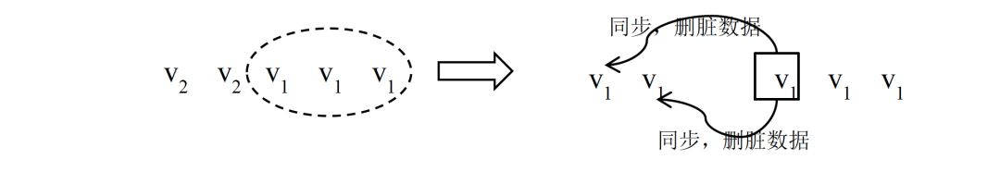

# 一、分布式系统
## 1 概念
### 1.1 模型
**节点**

在具体的工程项目中，一个节点往往是一个操作系统上的进程。在本文的模型中，认为节点是一个完整的、不可分的整体，如果某个程序进程实际上由若干相对独立部分构成，则在模型中可以将一个进程划分为多个节点。

**异常**

- 机器宕机：机器宕机是最常见的异常之一。
- 网络异常：消息丢失、消息乱序、数据错误、TCP协议只能保证同一个TCP 链接内的网络消息不乱序，TCP 链接之间的网络消息顺序则无法保证。
- 分布式三态：如果某个节点向另一个节点发起RPC(Remote procedure call)调用，操作的结果通过另一个消息返回，那么这个RPC 执行的结果有三种状态：“成功”、“失败”、“超时（未知）”，称之为分布式系统的三态。
- 存储数据丢失:对于有状态节点来说，数据丢失意味着状态丢失，通常只能从其他节点读取、恢复存储的状态。
- *异常处理原则*：被大量工程实践所检验过的异常处理黄金原则是：任何在设计阶段考虑到的异常情况一定会在系统实际运行中发生，但在系统实际运行遇到的异常却很有可能在设计时未能考虑，所以，除非需求指标允许，在系统设计时不能放过任何异常情况。

### 1.2 副本
对于数据副本指在不同的节点上持久化同一份数据，当出现某一个节点的存储的数据丢失时，可以从副本上读到数据。数据副本是分布式系统解决数据丢失异常的唯一手段。另一类副本是服务副本，指数个节点提供某种相同的服务，这种服务一般并不依赖于节点的本地存储，其所需数据一般来自其他节点。

副本协议是贯穿整个分布式系统的理论核心。

**副本一致性**

分布式系统通过副本控制协议，使得从系统外部读取系统内部各个副本的数据在一定的约束条件下相同，称之为副本一致性(consistency)。副本一致性是针对分布式系统而言的，不是针对某一个副本而言。

- 强一致性(strong consistency)：任何时刻任何用户或节点都可以读到最近一次成功更新的副本数据。强一致性是程度最高的一致性要求，也是实践中最难以实现的一致性。
- 单调一致性(monotonic consistency)：任何时刻，任何用户一旦读到某个数据在某次更新后的值，这个用户不会再读到比这个值更旧的值。单调一致性是弱于强一致性却非常实用的一种一致性级别。
- 会话一致性(session consistency)：任何用户在某一次会话内一旦读到某个数据在某次更新后的值，这个用户在这次会话过程中不会再读到比这个值更旧的值。会话一致性通过引入会话的概念，在单调一致性的基础上进一步放松约束，会话一致性只保证单个用户单次会话内数据的单调修改，对于不同用户间的一致性和同一用户不同会话间的一致性没有保障。实践中有许多机制正好对应会话的概念，例如php 中的session 概念。
- 最终一致性(eventual consistency)：最终一致性要求一旦更新成功，各个副本上的数据最终将达到完全一致的状态，但达到完全一致状态所需要的时间不能保障。对于最终一致性系统而言，一个用户只要始终读取某一个副本的数据，则可以实现类似单调一致性的效果，但一旦用户更换读取的副本，则无法保障任何一致性。
- 弱一致性(week consistency)：一旦某个更新成功，用户无法在一个确定时间内读到这次更新的值，且即使在某个副本上读到了新的值，也不能保证在其他副本上可以读到新的值。

### 1.3 衡量分布式系统的指标

- 性能：系统的吞吐能力、系统的响应延迟、系统的并发能力。三个性能指标往往会相互制约，追求高吞吐的系统，往往很难做到低延迟；系统平均响应时间较长时，也很难提高QPS。
- 可用性：系统的可用性(availability)指系统在面对各种异常时可以正确提供服务的能力。
- 可扩展性：系统的可扩展性(scalability)指分布式系统通过扩展集群机器规模提高系统性能（吞吐、延迟、并发）、存储容量、计算能力的特性。好的分布式系统总在追求“线性扩展性”，也就是使得系统的某一指标可以随着集群中的机器数量线性增长。
- 一致性：分布式系统为了提高可用性，总是不可避免的使用副本的机制，从而引发副本一致性的问题。越是强的一致的性模型，对于用户使用来说使用起来越简单。

## 2 分布式系统原理
### 2.1 数据分布方式
所谓分布式系统顾名思义就是利用多台计算机协同解决单台计算机所不能解决的计算、存储等问题。

**哈希方式**


哈希分布数据的缺点同样明显，突出表现为可扩展性不高，一旦集群规模需要扩展，则几乎所有的数据需要被迁移并重新分布。工程中，扩展哈希分布数据的系统时，往往使得集群规模成倍扩展，按照数据重新计算哈希，这样原本一台机器上的数据只需迁移一半到另一台对应的机器上即可完成扩展。
针对哈希方式扩展性差的问题，一种思路是不再简单的将哈希值与机器做除法取模映射，而是将对应关系作为元数据由专门的元数据服务器管理.同时，哈希值取模个数往往大于机器个数，这样同一台机器上需要负责多个哈希取模的余数。但需要以较复杂的机制维护大量的元数据。哈希分布数据的另一个缺点是，一旦某数据特征值的数据严重不均，容易出现“数据倾斜”（data skew）问题。
哈希分布数据的另一个缺点是，一旦某数据特征值的数据严重不均，容易出现“数据倾斜”（data skew）问题

**按数据范围分布**

按数据范围分布是另一个常见的数据分布式，将数据按特征值的值域范围划分为不同的区间，使得集群中每台（组）服务器处理不同区间的数据。

工程中，为了数据迁移等负载均衡操作的方便，往往利用动态划分区间的技术，使得每个区间中服务的数据量尽量的一样多。当某个区间的数据量较大时，通过将区间“分裂”的方式拆分为两个区间，使得每个数据区间中的数据量都尽量维持在一个较为固定的阈值之下。

**按数据量分布**

数据量分布数据与具体的数据特征无关，而是将数据视为一个顺序增长的文件，并将这个文件按照某一较为固定的大小划分为若干数据块（chunk），不同的数据块分布到不同的服务器上。与按数据范围分布数据的方式类似的是，按数据量分布数据也需要记录数据块的具体分布情况，并将该分布信息作为元数据使用元数据服务器管理。
由于与具体的数据内容无关，按数据量分布数据的方式一般没有数据倾斜的问题，数据总是被均匀切分并分布到集群中。当集群需要重新负载均衡时，只需通过迁移数据块即可完成。集群扩容也没有太大的限制，只需将部分数据库迁移到新加入的机器上即可以完成扩容。按数据量划分数据的缺点是需要管理较为复杂的元信息，与按范围分布数据的方式类似，当集群规模较大时，元信息的数据量也变得很大，高效的管理元信息成为新的课题。

**一致性哈希**

一致性哈希（consistent hashing）是另一个种在工程中使用较为广泛的数据分布方式。一致性哈希最初在P2P 网络中作为分布式哈希表（DHT）的常用数据分布算法。一致性哈希的基本方式是使用一个哈希函数计算数据或数据特征的哈希值，令该哈希函数的输出值域为一个封闭的环，即哈希函数输出的最大值是最小值的前序。将节点随机分布到这个环上，每个节点负责处理从自己开始顺时针至下一个节点的全部哈希值域上的数据。


使用一致性哈希的方式需要将节点在一致性哈希环上的位置作为元信息加以管理，这点比直接使用哈希分布数据的方式要复杂。然而，节点的位置信息只于集群中的机器规模相关，其元信息的量通常比按数据范围分布数据和按数据量分布数据的元信息量要小很多。

为此一种常见的改进算法是引入虚节点（virtual node）的概念，系统初始时就创建许多虚节点，虚节点的个数一般远大于未来集群中机器的个数，将虚节点均匀分布到一致性哈希值域环上，其功能与基本一致性哈希算法中的节点相同。为每个节点分配若干虚节点。操作数据时，首先通过数据的哈希值在环上找到对应的虚节点，进而查找元数据找到对应的真实节点。使用虚节点改进有多个优点。首先，一旦某个节点不可用，该节点将使得多个虚节点不可用，从而使得多个相邻的真实节点负载失效节点的压里。同理，一旦加入一个新节点，可以分配多个虚节点，从而使得新节点可以 负载多个原有节点的压力，从全局看，较容易实现扩容时的负载均衡。

**副本与数据分布**

分布式系统容错、提高可用性的基本手段就是使用副本。
更合适的做法不是以机器作为副本单位，而是将数据拆为较合理的数据段，以数据段为单位作为副本。

一旦副本分布与机器无关，数据丢失后的恢复效率将非常高。这是因为，一旦某台机器的数据丢失，其上数据段的副本将分布在整个集群的所有机器中，而不是仅在几个副本机器中，从而可以从整个集群同时拷贝恢复数据，而集群中每台数据源机器都可以以非常低的资源做拷贝。如果出现机器宕机，由于宕机机器上的副本分散于整个集群，其压力也自然分散到整个集群。最后，副本分布与机器无关也利于集群扩展。


**本地化计算**

在分布式系统中，数据的分布方式也深深影响着计算的分布方式。在分布式系统中计算节点和保存计算数据的存储节点可以在同一台物理机器上，也可以位于不同的物理机器。如果计算节点和存储节点位于不同的物理机器则计算的数据需要通过网络传输，此种方式的开销很大，甚至网络带宽会成为系统的总体瓶颈。另一种思路是，将计算尽量调度到与存储节点在同一台物理机器上的计算节点上进行，这称之为本地化计算。本地化计算是计算调度的一种重要优化，其体现了一种重要的分布式调度思想：“移动数据不如移动计算”。

**数据分布方式的选择**

在实际工程实践中，可以根据需求及实施复杂度合理选择数据分布方式。另外，数据分布方式是可以灵活组合使用的，往往可以兼备各种方式的优点，收到较好的综合效果。
例：数据倾斜问题，在按哈希分数据的基础上引入按数据量分布数据的方式，解决该数据倾斜问题。按用户id 的哈希值分数据，当某个用户id 的数据量特别大时，该用户的数据始终落在某一台机器上。此时，引入按数据量分布数据的方式，统计用户的数据量，并按某一阈值将用户的数据切为多个均匀的数据段，将这些数据段分布到集群中去。由于大部分用户的数据量不会超过阈值，所以元数据中仅仅保存超过阈值的用户的数据段分布信息，从而可以控制元数据的规模。这种哈希分布数据方式与按数据量分布数据方式组合使用的方案，在某真实系统中使用，取得了较好的效果。

### 2.2 基本副本协议
副本控制协议指按特定的协议流程控制副本数据的读写行为，副本控制协议总是在可用性、一致性与性能等各要素之间按照具体需求折中。

副本控制协议可以分为两大类：“中心化(centralized)副本控制协议”和“去中心化(decentralized)副本控制协议”。

**中心化副本控制协议**

中心化副本控制协议的基本思路是由一个中心节点协调副本数据的更新、维护副本之间的一致性。需要解决“写写”、“读写”等并发冲突。单机系统上常用加锁等方式进行并发控制。对于分布式并发控制，加锁也是一个常用的方法，但如果没有中心节点统一进行锁管理，就需要完全分布式化的锁系统，会使得协议非常复杂。中心化副本控制协议的缺点是系统的可用性依赖于中心化节点，当中心节点异常或与中心节点通信中断时，系统将失去某些服务（通常至少失去更新服务），所以中心化副本控制协议的缺点正是存在一定的停服务时间。


**primary-secondary 协议**

在primary-secondary 类型的协议中，副本被分为两大类，其中有且仅有一个副本作为primary 副本，除primary 以外的副本都作为secondary 副本。维护primary 副本的节点作为中心节点，中心节点负责维护数据的更新、并发控制、协调副本的一致性。

Primary-secondary 类型的协议一般要解决四大类问题：数据更新流程、数据读取方式、Primary 副本的确定和切换、数据同步（reconcile）。


**去中心化副本控制协议**

去中心化副本控制协议没有中心节点，协议中所有的节点都是完全对等的，节点之间通过平等协商达到一致。从而去中心化协议没有因为中心化节点异常而带来的停服务等问题。
去中心化协议的最大的缺点是协议过程通常比较复杂。尤其当去中心化协议需要实现强一致性时，协议流程变得复杂且不容易理解。由于流程的复杂，去中心化协议的效率或者性能一般也较中心化协议低。一个不恰当的比方就是，中心化副本控制协议类似专制制度，系统效率高但高度依赖于中心节点，一旦中心节点异常，系统受到的影响较大；去中心化副本控制协议类似民主制度，节点集体协商，效率低下，但个别节点的异常不会对系统总体造成太大影响。


### 2.3 Lease 机制
Lease 机制是最重要的分布式协议，广泛应用于各种实际的分布式系统中。

基于lease 的分布式cache 系统

基本的问题背景如下：在一个分布式系统中，有一个中心服务器节点，中心服务器存储、维护着一些数据，这些数据是系统的元数据。系统中其他的节点通过访问中心服务器节点读取、修改其上的元数据。由于系统中各种操作都依赖于元数据，如果每次读取元数据的操作都访问中心服务器 节点，那么中心服务器节点的性能成为系统的瓶颈。为此，设计一种元数据cache，在各个节点上 cache 元数据信息，从而减少对中心服务器节点的访问，提高性能。另一方面，系统的正确运行严格依赖于元数据的正确，这就要求各个节点上cache 的数据始终与中心服务器上的数据一致，cache 中的数据不能是旧的脏数据。最后，设计的cache 系统要能最大可能的处理节点宕机、网络中断等异常，最大程度的提高系统的可用性。

为此，利用lease 机制设计一套cache 系统，其基本原理为如下。中心服务器在向各节点发送数据时同时向节点颁发一个lease。每个lease 具有一个有效期，和信用卡上的有效期类似，lease 上的 有效期通常是一个明确的时间点，例如12:00:10，一旦真实时间超过这个时间点，则lease 过期失效。这样lease 的有效期与节点收到lease 的时间无关，节点可能收到lease 时该lease 就已经过期失效。这里首先假设中心服务器与各节点的时钟是同步的，在下节中讨论时钟不同步对lease 的影响。中心服务器发出的lease 的含义为：在lease 的有效期内，中心服务器保证不会修改对应数据的值。因此，节点收到数据和lease 后，将数据加入本地Cache，一旦对应的lease 超时，节点将对应的本地cache 数据删除。中心服务器在修改数据时，首先阻塞所有新的读请求，并等待之前为该数据发出的所有lease 超时过期，然后修改数据的值。

### 2.4 Quorum 机制

先做这样的约定：更新操作（write）是一系列顺序的过程，通过其他机制确定更新操作的顺序（例如primary-secondary 架构中由primary 决定顺序），每个更新操作记为wi， i 为更新操作单调递增的序号，每个wi 执行成功后副本数据都发生变化，称为不同的数据版本，记 作vi。假设每个副本都保存了历史上所有版本的数据。


**write-all-read-one**

Write-all-read-one（简称WARO）是一种最简单的副本控制规则，顾名思义即在更新时写所有的副本，只有在所有的副本上更新成功，才认为更新成功，从而保证所有的副本一致，这样在读取数据时可以读任一副本上的数据。

对于更新服务，虽然有N 个副本， 但系统无法容忍任何一个副本异常。另一方面，N 个副本中只要有一个副本正常，系统就可以提供读服务。对于读服务而言，当有N 个副本时，系统可以容忍N-1 个副本异常。从上述分析可以发现WARO 读服务的可用性较高，但更新服务的可用性不高，甚至虽然使用了副本，但更新服务的可用性等效于没有副本。

**Quorum 定义**

在Quorum 机制下，当某次更新操作wi 一旦在所有N 个副本中的W 个副本上都成功，则就称 该更新操作为“成功提交的更新操作”，称对应的数据为“成功提交的数据”。令R>N-W，由于更新 操作wi 仅在W 个副本上成功，所以在读取数据时，最多需要读取R 个副本则一定能读到wi 更新后 的数据vi 。如果某次更新wi 在W 个副本上成功，由于W+R>N，任意R 个副本组成的集合一定与 成功的W个副本组成的集合有交集，所以读取R 个副本一定能读到wi 更新后的数据vi。如图 2-10， Quorum 机制的原理可以文森图表示。

再次强调：仅仅依赖quorum 机制是无法保证强一致性的。因为仅有quorum 机制时无法确定最新已成功提交的版本号，除非将最新已提交的版本号作为元数据由特定的元数据服务器或元数据集群管理，否则很难确定最新成功提交的版本号。在下一节中，将讨论在哪些情况下，可以仅仅 通过quorum 机制来确定最新成功提交的版本号。

Quorum 机制的三个系统参数N、W、R 控制了系统的可用性，也是系统对用户的服务承诺：数据最多有N 个副本，但数据更新成功W 个副本即返回用户成功。对于一致性要求较高的Quorum 系统，系统还应该承诺任何时候不读取未成功提交的数据，即读取到的数据都是曾经在W 个副本上成功的数据。

**读取最新成功提交的数据**

Quorum 机制只需成功更新N 个副本中的W 个，在读取R 个副本时，一定可以读到最新的成功提交的数据。但由于有不成功的更新情况存在，仅仅读取R 个副本却不一定能确定哪个版本的数据 是最新的已提交的数据。对于一个强一致性Quorum 系统，若存在个数据少于W 个，假设为X 个，则继续读取其他副本，直若成功读取到W 个 该版本的副本，则该数据为最新的成功提交的数据；如果在所有副本中该数据的个数肯定不满 足W 个，则R 中版本号第二大的为最新的成功提交的副本。例：在读取到（v2 v1 v1）时，继续读取剩余的副本，若读到剩余两个副本 为（v2 v2）则v2 是最新的已提交的副本；若读到剩余的两个副本为（v2 v1）或（v1 v1）则v1 是最新成功提交的版本；若读取后续两个副本有任一超时或失败，则无法判断哪个版本是最新的成功提交的版本。

可以看出，在单纯使用Quorum 机制时，若要确定最新的成功提交的版本，最多需要读取R+ （W-R-1）=N 个副本，当出现任一副本异常时，读最新的成功提交的版本这一功能都有可能不可用。实际工程中，应该尽量通过其他技术手段，回避通过Quorum 机制读取最新的成功提交的版本。例如，当quorum 机制与primary-secondary 控制协议结合使用时，可以通过读取primary 的方式读取到最新的已提交的数据。

**基于Quorum 机制选择primary副本**

读取数据时依照一致性要求的不同可以有不同的做法：如果需要强一致性的立刻读取到最新的成功提交的数据，则可以简单的只读取primary 副本上的数据即可，也可以通过上节的方式读取；如果需要会话一致性，则可以根据之前已经读到的数据版本号在各个副本上进行选择性读取；如果只需要弱一致性，则可以选择任意副本读取。

在primary-secondary 协议中，当primary 异常时，需要选择出一个新的primary，之后secondary 副本与primary 同步数据。通常情况下，选择新的primary 的工作是由某一中心节点完成的，在引入 quorum 机制后，常用的primary 选择方式与读取数据的方式类似，即中心节点读取R 个副本，选择 R 个副本中版本号最高的副本作为新的primary。新primary 与至少W 个副本完成数据同步后作为新的primary 提供读写服务。首先，R 个副本中版本号最高的副本一定蕴含了最新的成功提交的数据。再者，虽然不能确定最高版本号的数是一个成功提交的数据，但新的primary 在随后与secondary 同 步数据，使得该版本的副本个数达到W，从而使得该版本的数据成为成功提交的数据。

例：在N=5，W=3，R=3 的系统中，某时刻副本最大版本号为（v2 v2 v1 v1 v1），此时v1 是系统的最新的成功提交的数据，v2 是一个处于中间状态的未成功提交的数据。假设此刻原primary 副本异常，中心节点进行primary 切换工作。这类“中间态”数据究竟作为“脏数据”被删除，还是作为新的数据被同步后成为生效的数据，完全取决于这个数据能否参与新primary 的选举。下面分别分析这两种情况。



第一、若中心节点与其中3 个副本通信成功，读取到的版本号为（v1 v1 v1），则任 选一个副本作为primary，新primary 以v1 作为最新的成功提交的版本并与其他副本同步，当与第1、第2 个副本同步数据时，由于第1、第2 个副本版本号大于primary，属于脏数据，可以按照2.2.2.4 节中介绍的处理脏数据的方式解决。实践中，新primary 也有可能与后两个副本完成同步后就提供数据服务，随后自身版本号也更新到v2，如果系统不能保证之后的v2 与之前的v2 完全一样，则新 primary 在与第1、2 个副本同步数据时不但要比较数据版本号还需要比较更新操作的具体内容是否一样。


第二、若中心节点与其他3 个副本通信成功，读取到的版本号为（v2 v1 v1），则选取版本号为 v2 的副本作为新的primary，之后，一旦新primary 与其他2 个副本完成数据同步，则符合v2 的副 本个数达到W 个，成为最新的成功提交的副本，新primary 可以提供正常的读写服务。


### 2.6 两阶段提交协议

两阶段提交协议是一种经典的强一致性中心化副本控制协议。虽然在工程中该协议有较多的问题，但研究该协议能很好的理解分布式系统的几个典型问题。

**流程描述**

两阶段提交协议是一种典型的“中心化副本控制”协议。在该协议中，参与的节点分为两类：一个中心化协调者节点（coordinator）和N 个参与者节点（participant）。每个参与者节点即上文背景介绍中的管理数据库副本的节点。

两阶段提交的思路比较简单，在第一阶段，协调者询问所有的参与者是否可以提交事务（请参与者投票），所有参与者向协调者投票。在第二阶段，协调者根据所有参与者的投票结果做出是否事务可以全局提交的决定，并通知所有的参与者执行该决定。在一个两阶段提交流程中，参与者不能改变自己的投票结果。两阶段提交协议的可以全局提交的前提是所有的参与者都同意提交事务，只要有一个参与者投票选择放弃(abort)事务，则事务必须被放弃。

**异常处理**

**宕机恢复**

**协议分析**

两阶段提交协议在工程实践中真正使用的较少，主要原因有以下几点：
1. 两阶段提交协议的容错能力较差
2. 两阶段提交协议的性能较差。

虽然存在一些改进的两阶段提交协议可以提高容错能力和性能，然而这类协议依旧是在工程中使用较少的一类协议，其理论价值大于实践意义。

### 2.7 Paxos协议
Paxos 协议是少数在工程实践中证实的强一致性、高可用的去中心化分布式协议。Paxos 协议的流程较为复杂，但其基本思想却不难理解，类似于人类社会的投票过程。Paxos 协议中，有一组完全对等的参与节点（称为accpetor），这组节点各自就某一事件做出决议，如果某个决议获得了超过半数节点的同意则生效。Paxos 协议中只要有超过一半的节点正常，就可以工作，能很好对抗宕机、网络分化等异常情况。

**角色**

Proposer：提案者。Proposer 可以有多个，Proposer 提出议案（value）。所谓value，在工程中可以是任何操作，例如“修改某个变量的值为某个值”、“设置当前primary 为某个节点”等等。Paxos 协议中统一将这些操作抽象为value。不同的Proposer 可以提出不同的甚至矛盾的value，例如某个Proposer 提议“将变量X 设置为1”，另一个Proposer 提议“将变量X 设置为2”，但对同一轮Paxos 过程，最多只有一个value 被批准。Acceptor：批准者。Acceptor 有N 个，Proposer 提出的value 必须获得超过半数(N/2+1)的Acceptor 批准后才能通过。Acceptor 之间完全对等独立。Learner：学习者。Learner 学习被批准的value。所谓学习就是通过读取各个Proposer 对value 的选择结果，如果某个value 被超过半数Proposer 通过，则Learner 学习到了这个value。回忆（2.4 ） 不难理解，这里类似Quorum 机制，某个value 需要获得W=N/2 + 1 的Acceptor 批准，从而学习者需要至少读取N/2+1 个Accpetor，至多读取N 个Acceptor 的结果后，能学习到一个通过的value。上述三类角色只是逻辑上的划分，实践中一个节点可以同时充当这三类角色。

**流程**

Paxos 协议一轮一轮的进行，每轮都有一个编号。每轮Paxos 协议可能会批准一个value，也可 能无法批准一个value。如果某一轮Paxos 协议批准了某个value，则以后各轮Paxos 只能批准这个 value。上述各轮协议流程组成了一个Paxos 协议实例，即一次Paxos 协议实例只能批准一个value，这也是Paxos 协议强一致性的重要体现。每轮Paxos 协议分为阶段，准备阶段和批准阶段，在这两个阶段Proposer 和Acceptor 有各自的处理流程。

流程：Proposer 的流程 （准备阶段）

1. 向所有的Acceptor 发送消息“Prepare(b)”；这里b 是Paxos 的轮数，每轮递增
2. 如果收到任何一个Acceptor 发送的消息“Reject(B)”，则对于这个Proposer 而言本轮Paxos 失败，将轮数b 设置为B+1 后重新步骤1；（批准阶段，根据收到的Acceptor 的消息作出不同选择）
3. 如果接收到的Acceptor 的“Promise(b, v_i)”消息达到N/2+1 个（N 为Acceptor 总数，除法取整， 下同）；v_i 表示Acceptor 最近一次在i 轮批准过value v。3.1 如果收到的“Promise(b, v)”消息中，v 都为空，Proposer 选择一个value v，向所有Acceptor 广播Accept(b, v)；3.2 否则，在所有收到的“Promise(b, v_i)”消息中，选择i 最大的value v，向所有Acceptor 广播消息Accept(b，v)；
4. 如果收到Nack(B)，将轮数b 设置为B+1 后重新步骤1；

流程：Accpetor 流程 （准备阶段）

1. 接受某个Propeser 的消息Prepare(b)。参数B 是该Acceptor 收到的最大Paxos 轮数编号；V 是Acceptor 批准的value，可以为空 1.1 如果b>B，回复Promise(b, V_B)，设置B=b; 表示保证不再接受编号小于b 的提案。1.2 否则，回复Reject(B) （批准阶段）
2. 接收Accept(b, v)， 2.1 如果b < B, 回复Nack(B)，暗示proposer 有一个更大编号的提案被这个Acceptor 接收了 2.2 否则设置V=v。表示这个Acceptor 批准的Value 是v。广播Accepted 消息。

**例子**

基本例子里有5 个Acceptor，1 个Proposer，不存在任何网络、宕机异常。我们着重考察各个Accpetor 上变量B 和变量V 的变化，及Proposer 上变量b 的变化。

1. 初始状态


2. Proposer 向所有Accpetor 发送“Prepare(1)”，所有Acceptor 正确处理，并回复Promise(1, NULL


3. Proposer 收到5 个Promise(1, NULL)，满足多余半数的Promise 的value 为空，此时发送 Accept(1, v1)，其中v1 是Proposer 选择的Value。


4. 此时，v1 被超过半数的Acceptor 批准，v1 即是本次Paxos 协议实例批准的Value。如果Learner 学习value，学到的只能是v1

在同一个Paxos 实例中，批准的Value 是无法改变的，即使后续Proposer 以更高的序号发起Paxos 协议也无法改变value。Paxos 协议的核心就在于“批准的value 无法改变”，这也是整个协议正确性的基础。

Paxos 协议是被人为设计出来，其设计过程也是协议的推导过程。Paxos 协议利用了Quorom 机 制，选择的W=R=N/2+1。简单而言，协议就是Proposer 更新Acceptor 的过程，一旦某个Acceptor 成功更新了超过半数的Acceptor，则更新成功。Learner 按Quorum 去读取Acceptor，一旦某个value 在超过半数的Proposer 上被成功读取，则说明这是一个被批准的value。协议通过引入轮次，使得高轮次的提议抢占低轮次的提议来避免死锁。协议设计关键点是如何满足“在一次Paxos 算法实例过程中只批准一个Value”这一约束条件。
### 2.8 CAP
CAP 理论的定义很简单，CAP 三个字母分别代表了分布式系统中三个相互矛盾的属性：

- Consistency (一致性)：CAP 理论中的副本一致性特指强一致性；
- Availiablity(可用性)：指系统在出现异常时已经可以提供服务；
- Tolerance to the partition of network (分区容忍)：指系统可以对网络分区这种异常情况进行容错处理；

CAP 理论指出：无法设计一种分布式协议，使得同时完全具备CAP 三个属性，即 ① 该种协议下的副本始终是强一致性， ② 服务始终是可用的， ③ 协议可以容忍任何网络分区异常；分布式系统协议只能在CAP 这三者间所有折中。

- Lease 机制: Lease 机制牺牲了部分异常情况下的A，从而获得了完全的C 与很好的P。
- Quorum 机制: Quorum 机制，在CAP 三大因素中都各做了折中，有一定的C，有较好 的A，也有较好的P，是一种较为平衡的分布式协议。
- 两阶段提交协议: 两阶段提交系统具有完全的C，很糟糕的A，很糟糕的P。
- Paxos 协议：同样是强一致性协议，Paxos 在CAP 三方面较之两阶段提交协议要优秀得多。Paxos 协议具有 完全的C，较好的A，较好的P。Paxos 的A 与P 的属性与Quorum 机制类似，因为Paxos 的协议本 身就具有Quorum 机制的因素。
# 二、分布式事务
事务可以看做是一次大的活动，它由不同的小活动组成，这些活动要么全部成功，要么全部失败。

# 三、分布式锁
可重入锁允许一个线程在持有锁的情况下再次获取该锁，而不会导致死锁。当线程再次获取锁时，需要记录获取锁的次数，并在每次释放锁时相应减少获取锁的次数，只有当获取锁的次数为0时，其他线程才能获取该锁。
## 1 为何需要分布式锁
- 效率:使用分布式锁可以避免不同节点重复相同的工作，这些工作会浪费资源。比如用户付了钱之后有可能不同节点会发出多封短信。
- 正确性:加分布式锁同样可以避免破坏正确性的发生，如果两个节点在同一条数据上面操作，比如多个节点机器对同一个订单操作不同的流程有可能会导致该笔订单最后状态出现错误，造成损失。
## 2 分布式锁的特点
- 互斥性:和我们本地锁一样互斥性是最基本，但是分布式锁需要保证在不同节点的不同线程的互斥。
- 可重入性:同一个节点上的同一个线程如果获取了锁之后那么也可以再次获取这个锁。
- 锁超时:和本地锁一样支持锁超时，防止死锁。
- 高效，高可用:加锁和解锁需要高效，同时也需要保证高可用防止分布式锁失效，可以增加降级。
- 支持阻塞和非阻塞:和ReentrantLock一样支持lock和trylock以及tryLock(long timeOut)。
- 支持公平锁和非公平锁(可选):公平锁的意思是按照请求加锁的顺序获得锁，非公平锁就相反是无序的。这个一般来说实现的比较少。
## 3 常见的分布式锁
- MySql
- Zk
- Redis
- 自研分布式锁:如谷歌的Chubby。
## 4 MySql 分布式锁
首先来说一下Mysql分布式锁的实现原理，相对来说这个比较容易理解，毕竟数据库和我们开发人员在平时的开发中息息相关。对于分布式锁我们可以创建一个锁表:

前面我们所说的lock(),trylock(long timeout)，trylock()这几个方法可以用下面的伪代码实现。
### 4.1 lock()
lock一般是阻塞式的获取锁，意思就是不获取到锁誓不罢休，那么我们可以写一个死循环来执行其操作:

mysqlLock.lcok内部是一个sql,为了达到可重入锁的效果那么我们应该先进行查询，如果有值，那么需要比较node_info是否一致，这里的node_info可以用机器IP和线程名字来表示，如果一致那么就加可重入锁count的值，如果不一致那么就返回false。如果没有值那么直接插入一条数据。伪代码如下:

需要注意的是这一段代码需要加事务，必须要保证这一系列操作的原子性。
### 4.2 trylock(long timeout)
tryLock()是非阻塞获取锁，如果获取不到那么就会马上返回。
### 4.3 unlock()
unlock的话如果这里的count为1那么可以删除，如果大于1那么需要减去1。
### 4.4 锁超时
有可能会遇到我们的机器节点挂了，那么这个锁就不会得到释放，我们可以启动一个定时任务，通过计算一般我们处理任务的一般的时间，比如是5ms，那么我们可以稍微扩大一点，当这个锁超过20ms没有被释放我们就可以认定是节点挂了然后将其直接释放。
### 4.5 小结
- 适用场景: Mysql分布式锁一般适用于资源不存在数据库，如果数据库存在比如订单，那么可以直接对这条数据加行锁，不需要我们上面多的繁琐的步骤，比如一个订单，那么我们可以用select * from order_table where id = 'xxx' for update进行加行锁，那么其他的事务就不能对其进行修改。
- 优点:理解起来简单，不需要维护额外的第三方中间件(比如Redis,Zk)。
- 缺点:虽然容易理解但是实现起来较为繁琐，需要自己考虑锁超时，加事务等等。性能局限于数据库，一般对比缓存来说性能较低。对于高并发的场景并不是很适合。
### 4.6 乐观锁
前面我们介绍的都是悲观锁，这里想额外提一下乐观锁，在我们实际项目中也是经常实现乐观锁，因为我们加行锁的性能消耗比较大，通常我们会对于一些竞争不是那么激烈，但是其又需要保证我们并发的顺序执行使用乐观锁进行处理，我们可以对我们的表加一个版本号字段，那么我们查询出来一个版本号之后，update或者delete的时候需要依赖我们查询出来的版本号，判断当前数据库和查询出来的版本号是否相等，如果相等那么就可以执行，如果不等那么就不能执行。这样的一个策略很像我们的CAS(Compare And Swap),比较并交换是一个原子操作。这样我们就能避免加select * for update行锁的开销。
## 5 Zk 分布式锁
ZooKeeper也是我们常见的实现分布式锁方法，相比于数据库如果没了解过ZooKeeper可能上手比较难一些。ZooKeeper是以Paxos算法为基础分布式应用程序协调服务。Zk的数据节点和文件目录类似，所以我们可以用此特性实现分布式锁。我们以某个资源为目录，然后这个目录下面的节点就是我们需要获取锁的客户端，未获取到锁的客户端注册需要注册Watcher到上一个客户端，可以用下图表示。


/lock是我们用于加锁的目录,/resource_name是我们锁定的资源，其下面的节点按照我们加锁的顺序排列。
### 5.1 Curator
Curator封装了Zookeeper底层的Api，使我们更加容易方便的对Zookeeper进行操作，并且它封装了分布式锁的功能，这样我们就不需要再自己实现了。

Curator实现了可重入锁(InterProcessMutex),也实现了不可重入锁(InterProcessSemaphoreMutex)。在可重入锁中还实现了读写锁。
### 5.2 InterProcessMutex
InterProcessMutex是Curator实现的可重入锁，我们可以通过下面的一段代码实现我们的可重入锁:


我们利用acuire进行加锁，release进行解锁。

加锁的流程具体如下:

1. 首先进行可重入的判定:这里的可重入锁记录在ConcurrentMap<Thread, LockData> threadData这个Map里面，如果threadData.get(currentThread)是有值的那么就证明是可重入锁，然后记录就会加1。我们之前的Mysql其实也可以通过这种方法去优化，可以不需要count字段的值，将这个维护在本地可以提高性能。
2. 然后在我们的资源目录下创建一个节点:比如这里创建一个/0000000002这个节点，这个节点需要设置为EPHEMERAL_SEQUENTIAL也就是临时节点并且有序。
3. 获取当前目录下所有子节点，判断自己的节点是否位于子节点第一个。
4. 如果是第一个，则获取到锁，那么可以返回。
5. 如果不是第一个，则证明前面已经有人获取到锁了，那么需要获取自己节点的前一个节点。/0000000002的前一个节点是/0000000001，我们获取到这个节点之后，再上面注册Watcher(这里的watcher其实调用的是object.notifyAll(),用来解除阻塞)。
6. object.wait(timeout)或object.wait():进行阻塞等待这里和我们第5步的watcher相对应。

解锁的具体流程:

1. 首先进行可重入锁的判定:如果有可重入锁只需要次数减1即可，减1之后加锁次数为0的话继续下面步骤，不为0直接返回。
2. 删除当前节点。
3. 删除threadDataMap里面的可重入锁的数据。
### 5.3 读写锁
Curator提供了读写锁，其实现类是InterProcessReadWriteLock，这里的每个节点都会加上前缀：
```
private static final String READ_LOCK_NAME  = "__READ__";
private static final String WRITE_LOCK_NAME = "__WRIT__";

```
根据不同的前缀区分是读锁还是写锁，对于读锁，如果发现前面有写锁，那么需要将watcher注册到和自己最近的写锁。写锁的逻辑和我们之前4.2分析的依然保持不变。
### 5.4 锁超时
Zookeeper不需要配置锁超时，由于我们设置节点是临时节点，我们的每个机器维护着一个ZK的session，通过这个session，ZK可以判断机器是否宕机。如果我们的机器挂掉的话，那么这个临时节点对应的就会被删除，所以我们不需要关心锁超时。
### 5.5 小结
- 优点:ZK可以不需要关心锁超时时间，实现起来有现成的第三方包，比较方便，并且支持读写锁，ZK获取锁会按照加锁的顺序，所以其是公平锁。对于高可用利用ZK集群进行保证。
- 缺点:ZK需要额外维护，增加维护成本，性能和Mysql相差不大，依然比较差。并且需要开发人员了解ZK是什么。
## 6 Redis 分布式锁
Redis因为其性能好，实现起来简单所以让很多人都对其十分青睐。
### 6.1 Redis分布式锁的简单实现
熟悉Redis的同学那么肯定对setNx(set if not exist)方法不陌生，如果不存在则更新，其可以很好的用来实现我们的分布式锁。对于某个资源加锁我们只需要
```
setNx resourceName value
```
这里有个问题，加锁了之后如果机器宕机那么这个锁就不会得到释放所以会加入过期时间，加入过期时间需要和setNx同一个原子操作，在Redis2.8之前我们需要使用Lua脚本达到我们的目的，但是redis2.8之后redis支持nx和ex操作是同一原子操作。
复制代码
```
set resourceName value ex 5 nx
```
### 6.2 Redission
Redission封装了锁的实现，其继承了java.util.concurrent.locks.Lock的接口，让我们像操作我们的本地Lock一样去操作Redission的Lock，下面介绍一下其如何实现分布式锁。


Redission不仅提供了Java自带的一些方法(lock,tryLock)，还提供了异步加锁，对于异步编程更加方便。
由于内部源码较多，就不贴源码了，这里用文字叙述来分析他是如何加锁的，这里分析一下tryLock方法:

1. 尝试加锁:首先会尝试进行加锁，由于保证操作是原子性，那么就只能使用lua脚本，相关的lua脚本如下：


可以看见他并没有使用我们的sexNx来进行操作，而是使用的hash结构，我们的每一个需要锁定的资源都可以看做是一个HashMap，锁定资源的节点信息是Key,锁定次数是value。通过这种方式可以很好的实现可重入的效果，只需要对value进行加1操作，就能进行可重入锁。当然这里也可以用之前我们说的本地计数进行优化。
2. 如果尝试加锁失败，判断是否超时，如果超时则返回false。
3. 如果加锁失败之后，没有超时，那么需要在名字为redisson_lock__channel+lockName的channel上进行订阅，用于订阅解锁消息，然后一直阻塞直到超时，或者有解锁消息。
4. 重试步骤1，2，3，直到最后获取到锁，或者某一步获取锁超时。

对于我们的unlock方法比较简单也是通过lua脚本进行解锁，如果是可重入锁，只是减1。如果是非加锁线程解锁，那么解锁失败。


Redission还有公平锁的实现，对于公平锁其利用了list结构和hashset结构分别用来保存我们排队的节点，和我们节点的过期时间，用这两个数据结构帮助我们实现公平锁，这里就不展开介绍了，有兴趣可以参考源码。
### 6.3 RedLock
我们想象一个这样的场景当机器A申请到一把锁之后，如果Redis主宕机了，这个时候从机并没有同步到这一把锁，那么机器B再次申请的时候就会再次申请到这把锁，为了解决这个问题Redis作者提出了RedLock红锁的算法,在Redission中也对RedLock进行了实现。


通过上面的代码，我们需要实现多个Redis集群，然后进行红锁的加锁，解锁。具体的步骤如下:

1. 首先生成多个Redis集群的Rlock，并将其构造成RedLock。
2. 依次循环对三个集群进行加锁，加锁的过程和5.2里面一致。
3. 如果循环加锁的过程中加锁失败，那么需要判断加锁失败的次数是否超出了最大值，这里的最大值是根据集群的个数，比如三个那么只允许失败一个，五个的话只允许失败两个，要保证多数成功。
4. 加锁的过程中需要判断是否加锁超时，有可能我们设置加锁只能用3ms，第一个集群加锁已经消耗了3ms了。那么也算加锁失败。
5. 3，4步里面加锁失败的话，那么就会进行解锁操作，解锁会对所有的集群在请求一次解锁。

可以看见RedLock基本原理是利用多个Redis集群，用多数的集群加锁成功，减少Redis某个集群出故障，造成分布式锁出现问题的概率。

### 6.4 小结
- 优点:对于Redis实现简单，性能对比ZK和Mysql较好。如果不需要特别复杂的要求，那么自己就可以利用setNx进行实现，如果自己需要复杂的需求的话那么可以利用或者借鉴Redission。对于一些要求比较严格的场景来说的话可以使用RedLock。
- 缺点:需要维护Redis集群，如果要实现RedLock那么需要维护更多的集群。
## 7 分布式锁的安全问题
上面我们介绍过红锁，但是Martin Kleppmann认为其依然不安全。有关于Martin反驳的几点，我认为其实不仅仅局限于RedLock,前面说的算法基本都有这个问题，下面我们来讨论一下这些问题:

- 长时间的GC pause:熟悉Java的同学肯定对GC不陌生，在GC的时候会发生STW(stop-the-world),例如CMS垃圾回收器，他会有两个阶段进行STW防止引用继续进行变化 *("STW" 则是 "Stop-The-World"（停顿整个世界）的缩写。在垃圾回收过程中，为了确保一致性和准确性，通常会暂停所有应用程序的执行。这意味着所有的用户线程都会被暂停，直到垃圾回收完成，这个过程就称为 STW)* 。那么有可能会出现下面图(引用至Martin反驳Redlock的文章)中这个情况：

client1获取了锁并且设置了锁的超时时间，但是client1之后出现了STW，这个STW时间比较长，导致分布式锁进行了释放，client2获取到了锁，这个时候client1恢复了锁，那么就会出现client1，2同时获取到锁，这个时候分布式锁不安全问题就出现了。这个其实不仅仅局限于RedLock,对于我们的ZK,Mysql一样的有同样的问题。
- 时钟发生跳跃:对于Redis服务器如果其时间发生了向跳跃，那么肯定会影响我们锁的过期时间，那么我们的锁过期时间就不是我们预期的了，也会出现client1和client2获取到同一把锁，那么也会出现不安全，这个对于Mysql也会出现。但是ZK由于没有设置过期时间，那么发生跳跃也不会受影响。
- 长时间的网络I/O:这个问题和我们的GC的STW很像，也就是我们这个获取了锁之后我们进行网络调用，其调用时间由可能比我们锁的过期时间都还长，那么也会出现不安全的问题，这个Mysql也会有，ZK也不会出现这个问题。
# 四、Docker
# 五、Kubernetes
