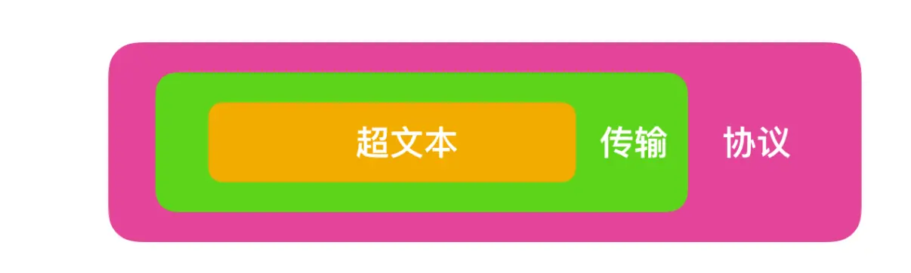

# TCP/IP

## 1. 计算机网络体系结构

## 2. 数据包
***包、帧、数据包、段、消息***
- 包可以说是全能性术语；
- 帧用于表示数据链路层中包的单位；
- 数据包是 IP 和 UDP 等网络层以上的分层中包的单位；
- 段则表示 TCP 数据流中的信息；
- 消息是指应用协议中数据的单位。  

***数据处理流程***

## 3. 传输层中的 TCP 和 UDP
**TCP/IP 中有两个具有代表性的传输层协议，分别是 TCP 和 UDP。**

- TCP 是面向连接的、可靠的流协议。流就是指不间断的数据结构，当应用程序采用 TCP 发送消息时，虽然可以保证发送的顺序，但还是犹如没有任何间隔的数据流发送给接收端。TCP 为提供可靠性传输，实行“顺序控制”或“重发控制”机制。此外还具备“流控制（流量控制）”、“拥塞控制”、提高网络利用率等众多功能。
- UDP 是不具有可靠性的数据报协议。细微的处理它会交给上层的应用去完成。在 UDP 的情况下，虽然可以确保发送消息的大小，却不能保证消息一定会到达。因此，应用有时会根据自己的需要进行重发处理。
- TCP 和 UDP 的优缺点无法简单地、绝对地去做比较：TCP 用于在传输层有必要实现可靠传输的情况；而在一方面，UDP 主要用于那些对高速传输和实时性有较高要求的通信或广播通信。TCP 和 UDP 应该根据应用的目的按需使用。

### 3.1 端口号
数据链路和 IP 中的地址，分别指的是 MAC 地址和 IP 地址。前者用来识别同一链路中不同的计算机，后者用来识别 TCP/IP  网络中互连的主机和路由器。在传输层也有这种类似于地址的概念，那就是端口号。端口号用来识别同一台计算机中进行通信的不同应用程序。因此，它也被称为程序地址。
### 3.2 UDP
- UDP 不提供复杂的控制机制，利用 IP 提供面向无连接的通信服务。
- 并且它是将应用程序发来的数据在收到的那一刻，立即按照原样发送到网络上的一种机制。即使是出现网络拥堵的情况，UDP 也无法进行流量控制等避免网络拥塞行为。
- 此外，传输途中出现丢包，UDP 也不负责重发。
甚至当包的到达顺序出现乱序时也没有纠正的功能。
如果需要以上的细节控制，不得不交由采用 UDP 的应用程序去处理。
- UDP 常用于一下几个方面：1.包总量较少的通信（DNS、SNMP等）；2.视频、音频等多媒体通信（即时通信）；3.限定于 LAN 等特定网络中的应用通信；4.广播通信（广播、多播）。
### 3.3 TCP
- TCP 与 UDP 的区别相当大。它充分地实现了数据传输时各种控制功能，可以进行丢包时的重发控制，还可以对次序乱掉的分包进行顺序控制。而这些在 UDP 中都没有。
- 此外，TCP 作为一种面向有连接的协议，只有在确认通信对端存在时才会发送数据，从而可以控制通信流量的浪费。
- 根据 TCP 的这些机制，在 IP 这种无连接的网络上也能够实现高可靠性的通信（ 主要通过检验和、序列号、确认应答、重发控制、连接管理以及窗口控制等机制实现）。
#### 3.3.1 TCP 三次握手
- TCP 提供面向有连接的通信传输。面向有连接是指在数据通信开始之前先做好两端之间的准备工作。
* 所谓三次握手是指建立一个 TCP 连接时需要客户端和服务器端总共发送三个包以确认连接的建立。在socket编程中，这一过程由客户端***执行connect***来触发。

下面来看看三次握手的流程图：
- 第一次握手：客户端将标志位SYN置为1，随机产生一个值seq=J，并将该数据包发送给服务器端，客户端进入SYN_SENT状态，等待服务器端确认。
- 第二次握手：服务器端收到数据包后由标志位SYN=1知道客户端请求建立连接，服务器端将标志位SYN和ACK都置为1，ack=J+1，随机产生一个值seq=K，并将该数据包发送给客户端以确认连接请求，服务器端进入SYN_RCVD状态。
- 第三次握手：客户端收到确认后，检查ack是否为J+1，ACK是否为1，如果正确则将标志位ACK置为1，ack=K+1，并将该数据包发送给服务器端，服务器端检查ack是否为K+1，ACK是否为1，如果正确则连接建立成功，客户端和服务器端进入ESTABLISHED状态，完成三次握手，随后客户端与服务器端之间可以开始传输数据了。

#### 3.3.2 TCP 四次挥手
- 四次挥手即终止TCP连接，就是指断开一个TCP连接时，需要客户端和服务端总共发送4个包以确认连接的断开。在socket编程中，这一过程由客户端或服务端任一方***执行close***来触发。
- 由于TCP连接是全双工的，因此，每个方向都必须要单独进行关闭，这一原则是当一方完成数据发送任务后，发送一个FIN来终止这一方向的连接，收到一个FIN只是意味着这一方向上没有数据流动了，即不会再收到数据了，但是在这个TCP连接上仍然能够发送数据，直到这一方向也发送了FIN。首先进行关闭的一方将执行主动关闭，而另一方则执行被动关闭。

下面来看看四次挥手的流程图：
- 中断连接端可以是客户端，也可以是服务器端。
- 第一次挥手：客户端发送一个FIN=M标记的包，用来关闭客户端到服务器端的数据传送，客户端进入FIN_WAIT_1状态。意思是说"我客户端没有数据要发给你了"，但是如果你服务器端还有数据没有发送完成，则不必急着关闭连接，可以继续发送数据。
- 第二次挥手：服务器端收到FIN后，先发送ack=M+1，告诉客户端，你的请求我收到了，但是我还没准备好，请继续你等我的消息。这个时候客户端就进入FIN_WAIT_2 状态，继续等待服务器端的FIN报文。
- 第三次挥手：当服务器端确定数据已发送完成，则向客户端发送FIN=N报文，告诉客户端，好了，我这边数据发完了，准备好关闭连接了。服务器端进入LAST_ACK状态。
- 第四次挥手：客户端收到FIN=N报文后，就知道可以关闭连接了，但是他还是不相信网络，怕服务器端不知道要关闭，所以发送ack=N+1后进入TIME_WAIT状态，如果Server端没有收到ACK则可以重传。服务器端收到ACK后，就知道可以断开连接了。客户端等待了2MSL后依然没有收到回复，则证明服务器端已正常关闭，那好，我客户端也可以关闭连接了。最终完成了四次握手。

**上面是一方主动关闭，另一方被动关闭的情况，实际中还会出现同时发起主动关闭的情况，**
具体流程如下图：

#### 3.3.3 通过序列号与确认应答提高可靠性
- 在 TCP 中，当发送端的数据到达接收主机时，接收端主机会返回一个已收到消息的通知。这个消息叫做**确认应答（ACK）**。
- 在一定时间内没有等待到确认应答，发送端就可以认为数据已经丢失，并进行重发。
- 此外，也有可能因为一些其他原因导致确认应答延迟到达，在源主机重发数据以后才到达的情况也屡见不鲜。此时，源主机只要按照机制重发数据即可。
- 对于目标主机来说，反复收到相同的数据是不可取的。为了对上层应用提供可靠的传输，目标主机必须放弃重复的数据包。为此引入了序列号。
- 序列号是按照顺序给发送数据的每一个字节（8位字节）都标上号码的编号。接收端查询接收数据 TCP 首部中的序列号和数据的长度，将自己下一步应该接收的序列号作为确认应答返送回去。通过序列号和确认应答号，TCP 能够识别是否已经接收数据，又能够判断是否需要接收，从而实现可靠传输。
#### 3.3.4 重发超时的确定
- **重发超时是指在重发数据之前，等待确认应答到来的那个特定时间间隔**。如果超过这个时间仍未收到确认应答，发送端将进行数据重发。最理想的是，找到一个最小时间，它能保证“确认应答一定能在这个时间内返回”。
- TCP 要求不论处在何种网络环境下都要提供高性能通信，并且无论网络拥堵情况发生何种变化，都必须保持这一特性。为此，它在每次发包时都会计算往返时间及其偏差。将这个往返时间和偏差时间相加，重发超时的时间就是比这个总和要稍大一点的值。
- 数据被重发之后若还是收不到确认应答，则进行再次发送。此时，等待确认应答的时间将会以2倍、4倍的指数函数延长。
- 此外，**数据也不会被无限、反复地重发。达到一定重发次数之后，如果仍没有任何确认应答返回，就会判断为网络或对端主机发生了异常，强制关闭连接。并且通知应用通信异常强行终止。**
#### 3.3.5 以段为单位发送数据
- TCP 以1个段为单位，每发送一个段进行一次确认应答的处理。这样的传输方式有一个缺点，就是包的往返时间越长通信性能就越低。
- 为解决这个问题，TCP 引入了窗口这个概念。确认应答不再是以每个分段，而是以更大的单位进行确认，转发时间将会被大幅地缩短。也就是说，发送端主机，在发送了一个段以后不必要一直等待确认应答，而是继续发送。
- 窗口大小就是指无需等待确认应答而可以继续发送数据的最大值。上图中窗口大小为4个段。这个机制实现了使用大量的缓冲区，通过对多个段同时进行确认应答的功能。
如下图所示：

#### 3.3.6 滑动窗口控制
- 窗口内的数据即便没有收到确认应答也可以被发送出去。不过，在整个窗口的确认应答没有到达之前，如果其中部分数据出现丢包，那么发送端仍然要负责重传。为此，发送端主机需要设置缓存保留这些待被重传的数据，直到收到他们的确认应答。
- 在滑动窗口以外的部分包括未发送的数据以及已经确认对端已收到的数据。当数据发出后若如期收到确认应答就可以不用再进行重发，此时数据就可以从缓存区清除。
- 收到确认应答的情况下，将窗口滑动到确认应答中的序列号的位置。这样可以顺序地将多个段同时发送提高通信性能。这种机制也别称为滑动窗口控制。

#### 3.3.7 窗口控制中的重发控制
在使用窗口控制中， 出现丢包一般分为两种情况：
1. 确认应答未能返回的情况。在这种情况下，数据已经到达对端，是不需要再进行重发的，如下图：

2. 某个报文段丢失的情况。接收主机如果收到一个自己应该接收的序列号以外的数据时，会针对当前为止收到数据返回确认应答。如下图所示，当某一报文段丢失后，发送端会一直收到序号为1001的确认应答，因此，在窗口比较大，又出现报文段丢失的情况下，同一个序列号的确认应答将会被重复不断地返回。而发送端主机如果连续3次收到同一个确认应答，就会将其对应的数据进行重发。这种机制比之前提到的超时管理更加高效，因此也被称为**高速重发控制**。

## 4. 网络层中的 IP 协议
- IP（IPv4、IPv6）相当于 OSI 参考模型中的第3层——网络层。网络层的主要作用是“实现终端节点之间的通信”。这种终端节点之间的通信也叫“点对点通信”。
- 网络的下一层——数据链路层的主要作用是在互连同一种数据链路的节点之间进行包传递。而一旦跨越多种数据链路，就需要借助网络层。网络层可以跨越不同的数据链路，即使是在不同的数据链路上也能实现两端节点之间的数据包传输。
- **IP 大致分为三大作用模块，它们是 IP 寻址、路由（最终节点为止的转发）以及 IP 分包与组包。**
### 4.1 IP 地址
#### 4.1.1 IP 地址由网络和主机两部分标识组成
#### 4.1.2 IP 地址的分类
- **IP 地址分为四个级别，分别为A类、B类、C类、D类。它根据 IP 地址中从第 1 位到第 4 位的比特列对其网络标识和主机标识进行区分。**
#### 4.1.3 子网掩码
- 子网掩码（Subnet Mask）是用于划分 IP 地址中网络和主机部分的32位二进制数。它与 IP 地址结合使用，用于定义一个网络中的子网和主机。子网掩码中的"1"表示网络部分，而"0"表示主机部分。
- IP 地址的网络地址部分用于进行路由控制。
### 4.2 IPv6
IPv6（IP version 6）是为了根本解决 IPv4 地址耗尽的问题而被标准化的网际协议。IPv4 的地址长度为 4 个 8 位字节，即 32 比特。而 IPv6 的地址长度则是原来的 4 倍，即 128 比特，一般写成 8 个 16 位字节
### 4.3 IP 隧道
- 如下图的网络环境中，网络 A 与网络 B 之间无法直接进行通信，为了让它们之间正常通信，这时必须得采用 IP 隧道的功能。
- IP 隧道可以将那些从网络 A 发过来的 IPv6 的包统合为一个数据，再为之追加一个 IPv4 的首部以后转发给网络 C。
- 一般情况下，紧接着 IP 首部的是 TCP 或 UDP 的首部。然而，现在的应用当中“ IP 首部的后面还是 IP 首部”或者“ IP 首部的后面是 IPv6 的首部”等情况与日俱增。这种在网络层的首部后面追加网络层首部的通信方法就叫做“ IP 隧道”。

## 5. HTTP协议
- HTTP 是基于TCP协议的应用层传输协议，简单来说就是客户端和服务端进行数据传输的一种规则。
- HTTP 是一种无状态 (stateless) 协议, HTTP协议本身不会对发送过的请求和相应的通信状态进行持久化处理。这样做的目的是为了保持HTTP协议的简单性，从而能够快速处理大量的事务, 提高效率。
- 然而，在许多应用场景中，我们需要保持用户登录的状态或记录用户购物车中的商品。由于HTTP是无状态协议，所以必须引入一些技术来记录管理状态，例如**Cookie**。

### 5.1 DNS
DNS 的全称是**域名系统**（Domain Name System，缩写：DNS），它作为将域名和 IP 地址相互映射的一个分布式数据库，能够使人更方便地访问互联网。
### 5.2 URI / URL
- URI的全称是（Uniform Resource Identifier），中文名称是统一资源标识符，使用它就能够唯一地标记互联网上资源。
- URL的全称是（Uniform Resource Locator），中文名称是统一资源定位符，也就是我们俗称的网址，它实际上是 URI 的一个子集。
- URI 不仅包括 URL，还包括 URN（统一资源名称），它们之间的关系如下:

### 5.3 HTTPS 
HTTP 一般是明文传输，很容易被攻击者窃取重要信息，鉴于此，HTTPS 应运而生。HTTPS 的全称为 （Hyper Text Transfer Protocol over SecureSocket Layer），全称有点长，HTTPS 和 HTTP 有很大的不同在于 HTTPS 是以安全为目标的 HTTP 通道，在 HTTP 的基础上通过传输加密和身份认证保证了传输过程的安全性。HTTPS 在 HTTP 的基础上增加了 SSL 层，也就是说 HTTPS = HTTP + SSL。
### 5.4 HTTP 报文
HTTP 协议主要由三大部分组成：
- **起始行（start line）**：描述请求或响应的基本信息；
- **头部字段（header）**：使用 key-value 形式更详细地说明报文；
- **消息正文（entity）**：实际传输的数据，它不一定是纯文本，可以是图片、视频等二进制数据。

其中起始行和头部字段并成为 请求头 或者 响应头，统称为 Header；消息正文也叫做实体，称为 body。HTTP 协议规定每次发送的报文必须要有 Header，但是可以没有 body，也就是说头信息是必须的，实体信息可以没有。而且在 header 和 body 之间必须要有一个空行（CRLF），如果用一幅图来表示一下的话，我觉得应该是下面这样

### 5.5 HTTP 请求方法
HTTP 请求方法一般分为 8 种，它们分别是
- GET 获取资源，GET 方法用来请求访问已被 URI 识别的资源。指定的资源经服务器端解析后返回响应内容。也就是说，如果请求的资源是文本，那就保持原样返回；
- POST 传输实体，虽然 GET 方法也可以传输主体信息，但是便于区分，我们一般不用 GET 传输实体信息，反而使用 POST 传输实体信息，
- PUT 传输文件，PUT 方法用来传输文件。就像 FTP 协议的文件上传一样，要求在请求报文的主体中包含文件内容，然后保存到请求 URI 指定的位置。

但是，鉴于 HTTP 的 PUT 方法自身不带验证机制，任何人都可以上传文件 , 存在安全性问题，因此一般的 W eb 网站不使用该方法。若配合 W eb 应用程序的验证机制，或架构设计采用REST（REpresentational State Transfer，表征状态转移）标准的同类 Web 网站，就可能会开放使用 PUT 方法。

- HEAD 获得响应首部，HEAD 方法和 GET 方法一样，只是不返回报文主体部分。用于确认 URI 的有效性及资源更新的日期时间等。
- DELETE 删除文件，DELETE 方法用来删除文件，是与 PUT 相反的方法。DELETE 方法按请求 URI 删除指定的资源。
- OPTIONS 询问支持的方法，OPTIONS 方法用来查询针对请求 URI 指定的资源支持的方法。
- TRACE 追踪路径，TRACE 方法是让 Web 服务器端将之前的请求通信环回给客户端的方法。
- CONNECT 要求用隧道协议连接代理，CONNECT 方法要求在与代理服务器通信时建立隧道，实现用隧道协议进行 TCP 通信。主要使用 SSL（Secure Sockets Layer，安全套接层）和 TLS（Transport Layer Security，传输层安全）协议把通信内容加 密后经网络隧道传输。
### 5.6 HTTP 请求URL
*http://*告诉浏览器使用何种协议。然后是*主机、端口、路径、查询参数、锚点*。